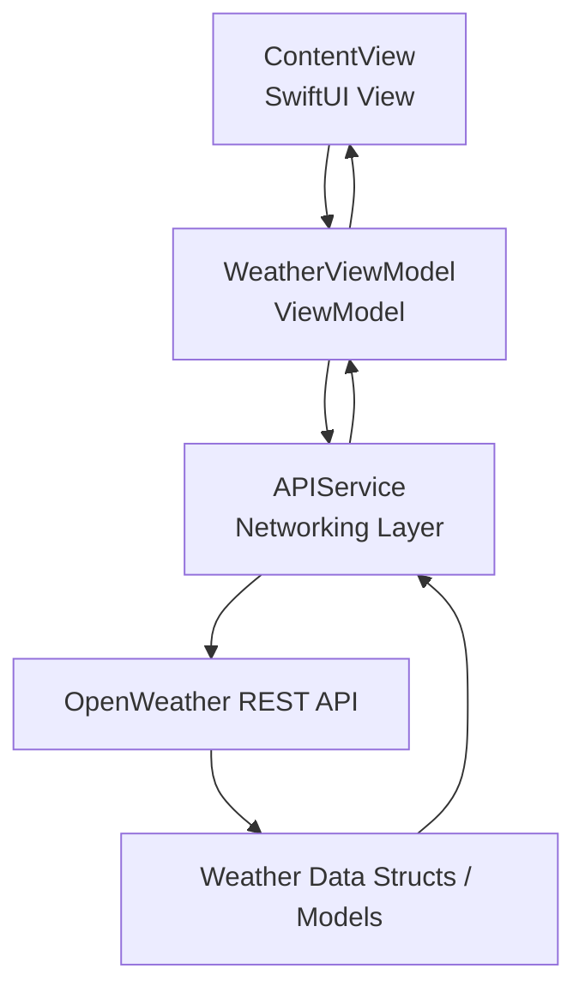

#  Flow — SwiftUI Weather App

A modern iOS weather application built with SwiftUI and async/await, demonstrating MVVM architecture, REST API integration, reusable UI components, and responsive state-driven interfaces.

## Tech Stack
- Swift
- SwiftUI
- Async/Await
- MVVM
- URLSession
- XCTest

## Features
- Current weather
- Forecast display
- Async API loading
- Error handling
- Loading states
- Responsive SwiftUI UI

## Architecture
The app uses MVVM to separate presentation and business logic, with async/await-based networking for clean asynchronous code.

## Screenshots

Currently uses openweathermap.org to get realtime weather
